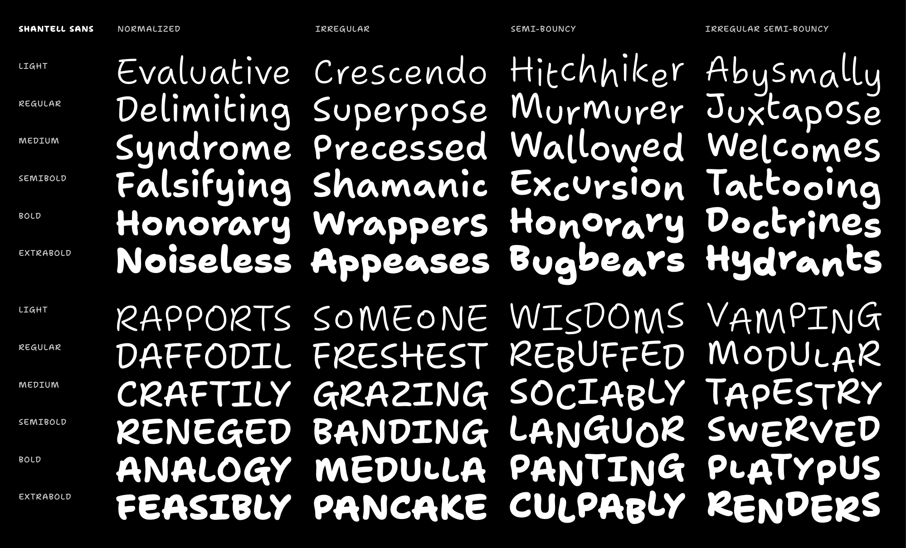

# Shantell Font Project

A custom font based on the handwriting of the artist [Shantell Martin](https://shantellmartin.art/).

Rather than trying to exactly mimim or “replace” Shantell’s writing, Shantell Sans takes inspiration from marker-based fonts like Comic Sans & Inkwell – aiming to find to create an authetically typographic system of a single shape per character, delivering an inviting and energetic tone while encouraging freedom and play.



## Font Features

### Variable Axes

Shantell’s writing is dynamic & doesn’t adhere to a rigid baseline or precise metrics, so Shantell Sans employs *variable axes* are to reflect this flexibility in a fluid range of styles.

Axis | Tag | Range | Default | Description
:-- | :-- | --: | --: | :--
Weight | `wght` | 300–800 | 300 | Light to ExtraBold. Can be defined with the `font-weight` CSS property.
Irregularity | `IRGL` | 0–1 | 0 | Emulates the irregular sizing of handwriting.
Bounce | `BNCE` | -100–100 | 0 | Emulates the bouncy baseline of handwriting, but extends this for extra fun.

### Character set

Shantell Sans supports a wide range of languages through Europe & the Americas, including English, Spanish, Portuguese, French, German, Polish, Dutch, Italian, Swedish, Norwegian, Danish, Croatian,Icelandic, Czech, Hungarian, and many more. It includes the following characters:

`A B C D E F G H I J K L M N O P Q R S T U V W X Y Z a b c d e f g h i j k l m n o p q r s t u v w x y z ! " #  % & ' ( ) * + , - . / 0 1 2 3 4 5 6 7 8 9 : ; < = > ? { | } [ \ ] ^ _ ~ ¡ $ ¢ £ € ¥ ¤ ℓ ¦ § ¨ © ® ™ ª º ¬ ¯ ± ´ µ ¶ · ¸ ¿ À Á Â Ã Ä Å Æ Ç È É Ê Ë Ì Í Î Ï Ð Ñ Ò Ó Ô Õ Ö × Ø Ù Ú Û Ü Ý Þ ß à á â ã ä å æ ç è é ê ë ì í î ï ð ñ ò ó ô õ ö ÷ ø ù ú û ü ý þ ÿ Ā ā Ă ă Ą ą Ć ć Č č Ď ď Đ đ Ē ē Ĕ ĕ Ė ė Ę ę Ě ě Ğ ğ Ģ ģ Ī ī Ĭ ĭ Į į İ ı IJ ij Ķ ķ Ĺ ĺ Ļ ļ Ľ ľ Ŀ Ŀ Ł ł Ń ń Ņ ņ Ň ň Ŋ ŋ Ō ō Ŏ ŏ Ő ő Œ œ Ŕ ŕ Ŗ ŗ Ř ř Ś ś Ş ş Š š Ţ ţ Ť ť Ŧ ŧ Ū ū Ŭ ŭ Ů ů Ű ű Ų ų Ÿ Ź ź Ż ż Ž ž ƒ Ǎ ǎ Ǔ ǔ Ǿ ǿ Ș ș Ț ț ˆ ˇ ˘ ˙ ˚ ˛ ˜ ˝ Ω π ẞ ‐ – — ‘ ’ ‚ “ ” „ † ‡ • … ‰ ′ ″ « » ‹ › ⁒ ⁰ ¹ ² ³ ⁴ ⁵ ⁶ ⁷ ⁸ ⁹ ₀ ₁ ₂ ₃ ₄ ₅ ₆ ₇ ₈ ₉ ⁄ ¼ ½ ¾ ⅓ ⅔ ⅛ ⅜ ⅝ ⅞ ° ∂ ∆ ∏ ∑ − ∕ √ ∞ ∫ ≈ ≠ ≤ ≥ ◊ ✓ ⟨ ⟩ ← ↑ → ↓ ↖ ↗ ↘ ↙ ♡ ♥ @`

### OpenType Features

Feature | Tag | Description
:-- | :-- | :--
Contexual Alternates | `calt` | On by default; adds randomization to Irregular & Bouncy styles
Case-sensitive punctuation | `case` | Makes punctuation fit cap-height for uppercase typesetting
Arbitrary Fractions | `frac` | Makes proper fractions from strings like 1/2
Tabular Figures | `tnum` | Numbers & currencies are monospaced across styles by default to improve table layout, but this makes certain punctuation become tabular as well
Proportional Figures | `pnum` | Makes numbers take up a natural amount of space
Localized Forms | `locl` | Supports special language requirements for Catalan, Moldovian & Romanian, Dutch, Turkish, and more
Standard Ligatures | `liga` | Converts 3+ repeated hyphens into wavy lines, just for fun

## Building the fonts

### Set up requirements

Install pipenv.

```bash
pip install pipenv
```

Start the `pipenv` shell:

```bash
pipenv shell
```

Install dependencies from `Pipfile.lock`.

```bash
pipenv sync
```

Finally, give the build scripts permission to run:

```bash
chmod +x scripts--build/*.sh
```

### Build

```bash
python3 scripts--build/prep-build.py
```

This will prep a folder like `sources/wght_BNCE_IRGL--prepped`. Copy in the designspace, such as `sources/wght_BNCE_IRGL--prepped/shantell_sans-wght_BNCE_IRGL.designspace`.

Build the variable font:

```bash
scripts--build/build-vf.sh
```

Build the static fonts:

```bash
scripts--build/build-static.sh
```

## Release

Update the version number in `version.txt` to the desired next release number, then build fonts.

Then, run this script to create a zipped archive of the fonts folder:

```bash
scripts--build/make-release.sh
```
