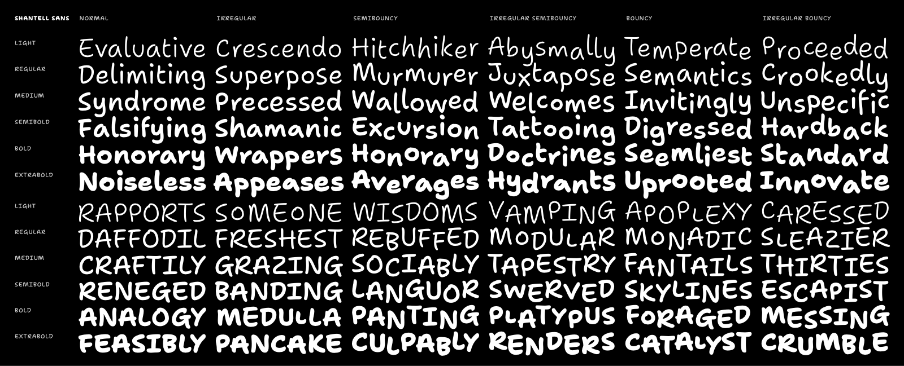
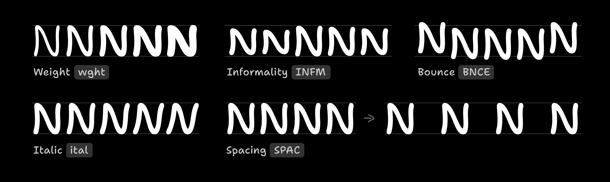
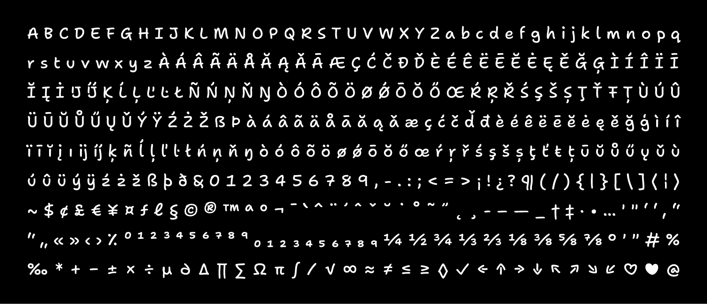

# Shantell Sans

A custom font based on the handwriting of the artist [Shantell Martin](https://shantellmartin.art/).

Rather than trying to exactly mimim or “replace” Shantell’s writing, Shantell Sans takes inspiration from marker-based fonts like Comic Sans & Inkwell Sans. It aims to create an authetically typographic system with a single core shape per character in order to deliver a simple, inviting, and energetic tone while encouraging freedom and play.



## Font Features

### Variable Axes

Shantell’s writing is dynamic and doesn’t adhere to a rigid baseline or precise metrics, so Shantell Sans employs *variable axes* are to reflect this flexibility in a fluid range of styles.



Axis | Tag | Range | Default | Description
:-- | :-- | --: | --: | :--
Weight | `wght` | 300–800 | 300 | Light to ExtraBold. Can be defined with the `font-weight` CSS property.
Irregularity | `IRGL` | 0–1 | 0 | Emulates the irregular sizing of handwriting.
Bounce | `BNCE` | -100–100 | 0 | Emulates the bouncy baseline of handwriting, but extends this for extra fun.

### Character set

Shantell Sans supports a wide range of languages through Europe & the Americas, including English, Spanish, Portuguese, French, German, Polish, Dutch, Italian, Swedish, Norwegian, Danish, Croatian,Icelandic, Czech, Hungarian, and many more. It includes the following characters:



<details>
<summary>Character set as selectable text (Click to expand)</summary>

A B C D E F G H I J K L M N O P Q R S T U V W X Y Z a b c d e f g h i j k l m n o p q r s t u v w x y z À Á Â Ã Ä Å Ă Ą Ǎ Ā Æ Ç Ć Č Ð Ď È É Ê Ë Ē Ĕ Ė Ę Ě Ğ Ģ Ì Í Î Ï Ī Ĭ Į İ IJ Ķ Ĺ Ļ Ľ Ŀ Ł Ñ Ń Ņ Ň Ŋ Ò Ó Ô Õ Ö Ø Ǿ Ō Ŏ Ő Œ Ŕ Ŗ Ř Ś Ş Š Ș Ţ Ť Ŧ Ț Ù Ú Û Ü Ū Ŭ Ů Ű Ų Ǔ Ý Ÿ Ź Ż Ž ẞ Þ à á â ã ä å ā ă ą ǎ æ ç ć č ď đ è é ê ë ē ĕ ė ę ě ğ ģ ì í î ï ī ĭ į ı ij ķ ñ ĺ ļ ľ ŀ ł ń ņ ň ŋ ò ó ô õ ö ø ǿ ō ŏ ő œ ŕ ŗ ř ś ş š ș ţ ť ŧ ț ū ŭ ů ű ų ǔ ù ú û ü ý ÿ ź ż ž ß þ ð & 0 1 2 3 4 5 6 7 8 9 , - . : ; < = > ¡ ! ¿ ? ¶ ( / ) { | } [ \ ] ⟨ ¦ ⟩ ~ $ ¢ £ € ¥ ¤ ƒ ℓ § © ® ™ ª º ¬ ¯ ` ^ ¨ ´ ˆ ˇ ˘ ˙ ˚ ˜ ˝ ˛ ¸ ‐ – — _ † ‡ · • … ' " ‘ ’ ‚ “ ” „ « » ‹ › ⁒ ⁰ ¹ ² ³ ⁴ ⁵ ⁶ ⁷ ⁸ ⁹ ₀ ₁ ₂ ₃ ₄ ₅ ₆ ₇ ₈ ₉ ¼ ½ ¾ ⅓ ⅔ ⅛ ⅜ ⅝ ⅞ ° ′ ″ # % ‰ * + − ± × ÷ µ ∂ ∆ ∏ ∑ Ω π ∫ ∕ √ ∞ ≈ ≠ ≤ ≥ ◊ ✓ ← ↑ → ↓ ↖ ↗ ↘ ↙ ♡ ♥ @

</details>

### OpenType Features

Feature | Tag | Description
:-- | :-- | :--
Contexual Alternates | `calt` | On by default; adds randomization to Irregular & Bouncy styles
Case-sensitive punctuation | `case` | Makes punctuation fit cap-height for uppercase typesetting
Arbitrary Fractions | `frac` | Makes proper fractions from strings like 1/2
Tabular Figures | `tnum` | Numbers & currencies are monospaced across styles by default to improve table layout, but this makes certain punctuation become tabular as well
Proportional Figures | `pnum` | Makes numbers take up a natural amount of space
Localized Forms | `locl` | Supports special language requirements for Catalan, Moldovian & Romanian, Dutch, Turkish, and more
Standard Ligatures | `liga` | Converts 3+ repeated hyphens into wavy lines, just for fun

## Build

<details>
<summary><b><!-------->How to build the fonts locally<!--------></b> (Click to expand)</summary>

### Set up requirements

Make a virtual environment:

```bash
python3 -m venv venv
```

Activate venv:

```
source venv/bin/activate
```

Install dependencies:

```bash
pip install -U -r requirements.txt
```

Finally, give the build scripts permission to run:

```bash
chmod +x scripts--build/*.sh
```

Finally, you will also need to separately install [google/woff2](https://github.com/google/woff2) to enable the `woff2_compress` and `woff2_decompress` commands. Open a new terminal session, window, or tab to do this step.

```bash
# 👉 open a new terminal session first, then run this
git clone --recursive https://github.com/google/woff2.git
cd woff2
make clean all
```

### Building the fonts

```bash
source venv/bin/activate # activate venv if not already active
python3 scripts--build/prep-build.py
```

This will prep a folder like `sources/wght_BNCE_IRGL--prepped`. Copy in the designspace, such as `sources/wght_BNCE_IRGL--prepped/shantell_sans-wght_BNCE_IRGL.designspace`.

Build the variable font:

```bash
scripts--build/build-vf.sh
```

Build the static fonts:

```bash
scripts--build/build-static.sh
```

## Release

Update the version number in `version.txt` to the desired next release number, then build fonts.

Then, run this script to create a zipped archive of the fonts folder:

```bash
source venv/bin/activate # activate venv if not already active
scripts--build/make-release.sh
```

</details>
