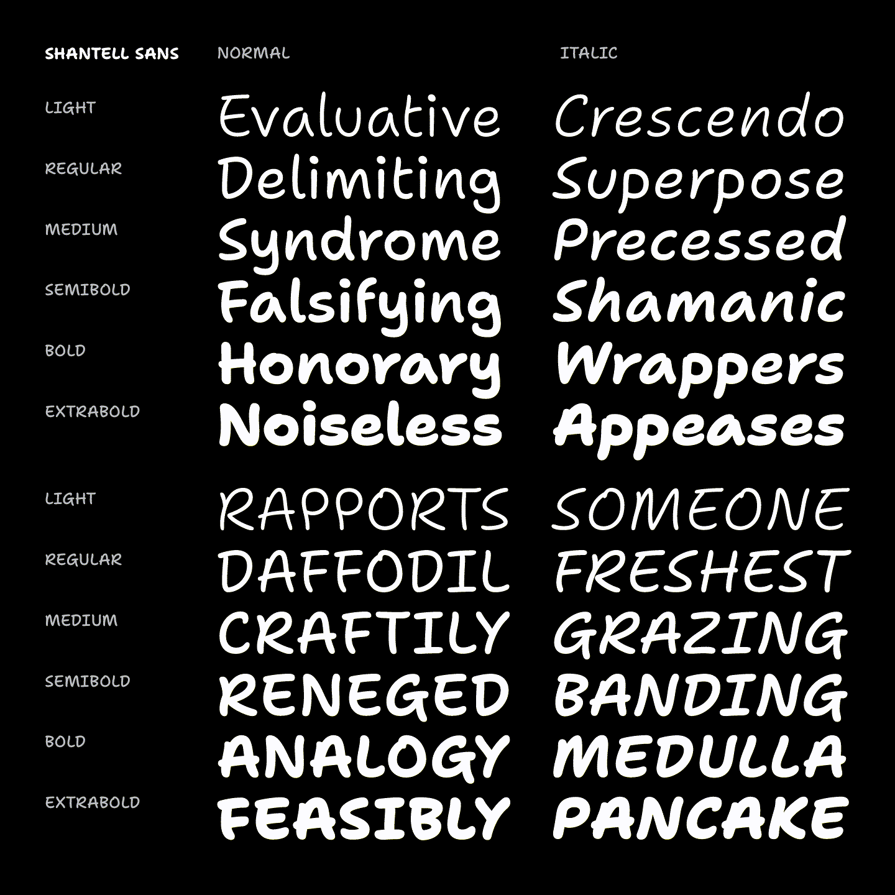
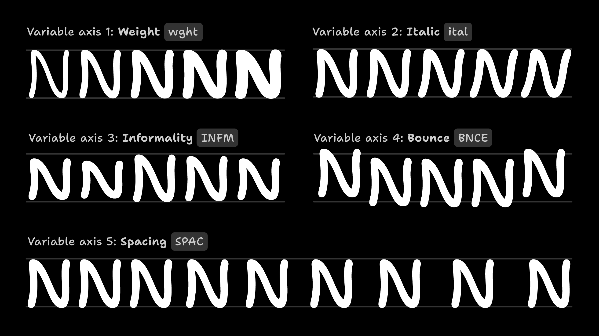
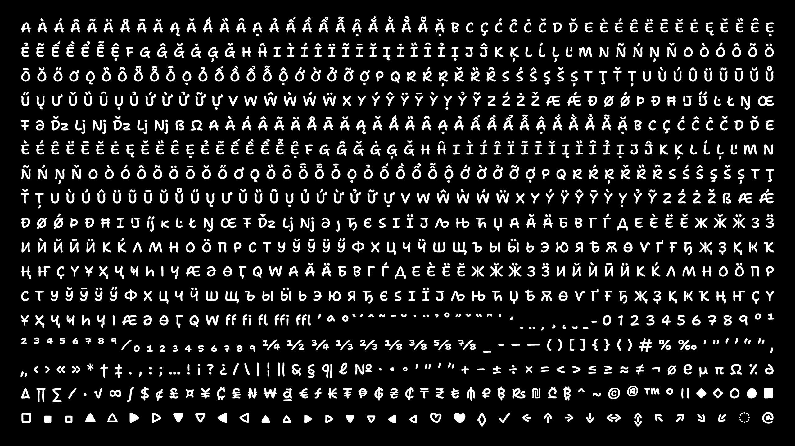

# Shantell Sans

Shantell Sans, from [Shantell Martin](https://shantellmartin.art/), is a marker-style font built for creative expression, typographic play, and animation.


Shantell Sans is a project based on the artwork, handwriting, and creative philosophy of Shantell Martin. Rather than trying to exactly mimick or “replace” Shantell’s writing, Shantell Sans takes inspiration from marker-based fonts like Comic Sans & Inkwell Sans. It aims to create an authetically typographic system with a single core shape per character, in order to deliver a simple, inviting, and energetic tone while encouraging freedom and play.

To download Shantell Sans, [please see the latest release](https://github.com/arrowtype/shantell-sans/releases) and download the zip file.

### Project credits

Project conception and creative direction by [Shantell Martin](https://shantellmartin.art/info).

Type design & development by [Arrow Type](https://arrowtype.com) / Stephen Nixon.

Cyrillic type design by [Anya Danilova](http://anyadanilova.com).

Additional support from [Google Fonts](https://fonts.google.com).

### Type Specimen / Minisite

Shantell Sans has a minisite at [shantellsans.com](https://shantellsans.com), with an open repo on GitHub at [arrowtype/shantell-sans-specimen](https://github.com/arrowtype/shantell-sans-specimen).

## Font Features

### Styles / Instances

Shantell Sans includes a wide array of styles, available both in a single variable font and in separate static font files.



### Variable Axes

Shantell’s writing is dynamic and doesn’t adhere to a rigid baseline or precise metrics, so Shantell Sans employs *variable axes* are to reflect this flexibility in a fluid range of styles.



| Axis        | Tag    |    Range | Default | Description                                                                                                                                                                                                                    |
| :---------- | :----- | -------: | ------: | :----------------------------------------------------------------------------------------------------------------------------------------------------------------------------------------------------------------------------- |
| Weight      | `wght` |  300–800 |     300 | Light to ExtraBold. Can be defined with the `font-weight` CSS property.                                                                                                                                                        |
| Italic      | `ital` |      0–1 |       0 | Upright to Italic. Can be defined with the `font-style` CSS property.                                                                                                                                                          |
| Bounce      | `BNCE` | -100–100 |       0 | Emulates the bouncy baseline of handwriting. Note: see below for how to make this fully work in MS Word and Adobe Illustrator → [(“Making Randomization Work”)](#making-randomization-work-bounce-and-informality-axesstyles). |
| Informality | `INFM` |    0–100 |       0 | Emulates the irregular shaping and proportions of handwriting.                                                                                                                                                                 |
| Spacing     | `SPAC` |    0–100 |       0 | Adds extra spacing to the left and right of each glyph.                                                                                                                                                                        |

Bounce, Informality, and Spacing can be defined in the `font-variation-settings` CSS property. See [this guide to using custom axes in CSS](https://variablefonts.io/about-variable-fonts/#custom) for more information.

### Character set

Shantell Sans supports a wide range of 380+ languages using Latin & Cyrillic scripts, throughout Europe, the Americas, central Asia, and Vietnam. 



It includes the following characters:

```
A À Á Â Ã Ä Å Ā Ă Ą Ǎ Ǻ Ȁ Ȃ Ạ Ả Ấ Ầ Ẩ Ẫ Ậ Ắ Ằ Ẳ Ẵ Ặ B C Ç Ć Ĉ Ċ Č D Ď E È É Ê Ë Ē Ĕ Ė Ę Ě Ȅ Ȇ Ẹ Ẻ Ẽ Ế Ề Ể Ễ Ệ F G Ĝ Ğ Ġ Ģ Ǧ H Ĥ I Ì Í Î Ï Ĩ Ī Ĭ Į İ Ȉ Ȋ Ỉ Ị J Ĵ K Ķ L Ĺ Ļ Ľ M N Ñ Ń Ņ Ň O Ò Ó Ô Õ Ö Ō Ŏ Ő Ơ Ǫ Ȍ Ȏ Ȫ Ȭ Ȱ Ọ Ỏ Ố Ồ Ổ Ỗ Ộ Ớ Ờ Ở Ỡ Ợ P Q R Ŕ Ŗ Ř Ȑ Ȓ S Ś Ŝ Ş Š Ș T Ţ Ť Ț U Ù Ú Û Ü Ũ Ū Ŭ Ů Ű Ų Ư Ǔ Ȕ Ȗ Ụ Ủ Ứ Ừ Ử Ữ Ự V W Ŵ Ẁ Ẃ Ẅ X Y Ý Ŷ Ÿ Ȳ Ỳ Ỵ Ỷ Ỹ Z Ź Ż Ž Æ Ǽ Ð Ø Ǿ Þ Đ Ħ IJ  Ŀ Ł Ŋ Œ Ŧ Ə DŽ LJ NJ Dž Lj Nj ẞ Ω a à á â ã ä å ā ă ą ǎ ǻ ȁ ȃ ạ ả ấ ầ ẩ ẫ ậ ắ ằ ẳ ẵ ặ b c ç ć ĉ ċ č d ď e è é ê ë ē ĕ ė ę ě ȅ ȇ ẹ ẻ ẽ ế ề ể ễ ệ f g ĝ ğ ġ ģ ǧ h ĥ i ì í î ï ĩ ī ĭ į ȉ ȋ ỉ ị j ĵ k ķ l ĺ ļ ľ m n ñ ń ņ ň o ò ó ô õ ö ō ŏ ő ơ ǫ ȍ ȏ ȫ ȭ ȱ ọ ỏ ố ồ ổ ỗ ộ ớ ờ ở ỡ ợ p q r ŕ ŗ ř ȑ ȓ s ś ŝ ş š ș t ţ ť ț u ù ú û ü ũ ū ŭ ů ű ų ư ǔ ȕ ȗ ụ ủ ứ ừ ử ữ ự v w ŵ ẁ ẃ ẅ x y ý ÿ ŷ ȳ ỳ ỵ ỷ ỹ z ź ż ž ß æ ǽ ð ø ǿ þ đ ħ ı ij  ĸ ŀ ł ŋ œ ŧ dž lj nj ə ȷ Ђ Є Ѕ І Ї Ј Љ Њ Ћ Џ А Ӑ Ӓ Б В Г Ѓ Д Е Ѐ Ё Ӗ Ж Ӂ Ӝ З Ӟ И Ѝ Й Ӣ Ӥ К Ќ Л М Н О Ӧ П Р С Т У Ў Ӯ Ӱ Ӳ Ф Х Ц Ч Ӵ Ш Щ Ъ Ы Ӹ Ь Э Ю Я Ѣ Ѫ Ѳ Ѵ Ґ Ғ Ҕ Җ Ҙ Қ Ҝ Ҡ Ң Ҥ Ҫ Ү Ұ Ҳ Ҷ Ҹ Һ Ӏ Ӌ Ӕ Ә Ө Ӷ Ԛ Ԝ а ӑ ӓ б в г ѓ д е ѐ ё ӗ ж ӂ ӝ з ӟ и й ѝ ӣ ӥ к ќ л м н о ӧ п р с т у ў ӯ ӱ ӳ ф х ц ч ӵ ш щ ъ ы ӹ ь э ю я ђ є ѕ і ї ј љ њ ћ џ ѣ ѫ ѳ ѵ ґ ғ ҕ җ ҙ қ ҝ ҡ ң ҥ ҫ ү ұ ҳ ҷ ҹ һ ӌ ӏ ӕ ә ө ӷ ԛ ԝ ff fi fl ffi ffl ʼ ª º ̀ ́  ̂  ̃  ̄  ̆  ̇  ̈  ̉  ̊  ̋  ̌  ̏  ̑  ̒  ̛  ̣  ̤  ̦  ̧  ̨  ̮  ̱ ̵  0 1 2 3 4 5 6 7 8 9 ⁰ ¹ ² ³ ⁴ ⁵ ⁶ ⁷ ⁸ ⁹ ⁄ ₀ ₁ ₂ ₃ ₄ ₅ ₆ ₇ ₈ ₉ ¼ ½ ¾ ⅓ ⅔ ⅛ ⅜ ⅝ ⅞ _ - ‐ – — ( ) [ ] { } ⟨ ⟩ # % ‰ ' " ‘ ’ “ ” ‚ „ ‹ › « » * † ‡ . , : ; … ! ¡ ? ¿ / / \ | ¦ ‖ & § ¶ ℓ № · • ◦ ′ ″ ʹ ʺ + − ± ÷ × = < > ≤ ≥ ≈ ≠ ¬ ∅ ℮ µ π Ω ⁒ ∂ ∆ ∏ ∑ ∕ ∙ √ ∞ ∫ $ ¢ £ ¤ ¥ ₡ ₤ ₦ ₩ ₫ € ƒ ₭ ₮ ₱ ₲ ₴ ₵ ₸ ₹ ₺ ₼ ₽ ฿ ₨ ₪ ₾ ₿ ^ ~ ´ ` ˝ ˆ ˇ ˘ ˜ ¯ ¨ ˙ ˚ ¸ ˛ © ® ™ ° ⏸ ◆ ◇ ○ ● ■ □ ▪ ▫ ▲ △ ▶ ▷ ▼ ▽ ◀ ◁ ▴ ▵ ▸ ▹ ▾ ▿ ◂ ◃ ♡ ♥ ◊ ✓ ✔ ­ ← ↑ → ↓ ↔ ↕ ↖ ↗ ↘ ↙ ◌ @
```

### OpenType Features

#### User-facing features 

The following features control font options you might wish to adjust in software and via the [CSS property `font-feature-settings`](https://developer.mozilla.org/en-US/docs/Web/CSS/font-feature-settings).

| Feature                    | Tag    | Description                                                                                                                                     |
| :------------------------- | :----- | :---------------------------------------------------------------------------------------------------------------------------------------------- |
| Case-sensitive punctuation | `case` | Makes punctuation fit cap-height for uppercase typesetting                                                                                      |
| Arbitrary Fractions        | `frac` | Makes proper fractions from strings like 1/2 and 12/345                                                                                         |
| Tabular Figures            | `tnum` | Numbers & currencies are monospaced across styles by default to improve table layout, but this makes certain punctuation become tabular as well |
| Proportional Figures       | `pnum` | Makes numbers take up a natural amount of space                                                                                                 |
| Ordinals                   | `ordn` | Activates ordinals, primarily for Spanish                                                                                                       |
| Superscript                | `sups` | Activates superscript numerals, e.g. for footnotes & exponents                                                                                  |
| Scientific Inferiors       | `sinf` | Activates subscript/inferior numerals, e.g. for scientific chemical notations                                                                   |
| Slashed Zero               | `zero` | Activates a slashed form of zero for higher legibility numbering                                                                                |
| Standard Ligatures         | `liga` | Converts 3+ repeated hyphens into wavy lines, just for fun                                                                                      |
| Stylistic Sets             | `ss0X` | Several stylistic sets exist to help toggle different character forms for Cyrillic languages, as a backup to software-level localization        |

#### Other features 

Other features are mostly intended to be handled by software and ignored by users.

| Feature              | Tag    | Description                                                                                                                  |
| :------------------- | :----- | :--------------------------------------------------------------------------------------------------------------------------- |
| Contexual Alternates | `calt` | On by default; activates a ligature for `її`, used in Ukrainian                                                              |
| Localized Forms      | `locl` | Supports special character-design requirements for various languages (TRK, CAT, ROM, MOL, NLD, BGR, SRB, MKD, UKR, and more) |
| Required Ligatures   | `rlig` | On by default; adds pseudo-random pattern to alternates in Irregular & Bouncy styles                                         |

Also included are `aalt`, `kern`, `ccmp`, `dnom`, `numr`, `mark`, and `mkmk`.

### Making randomization work (Bounce and Informality axes/styles)

In most apps and web browers, the *Bounce* and *Informality* axes and styles automatically apply randomization to text. Specifically, the font will cycle through several alternates of each glyph, to make text more lively and give it a more “handwritten” appearance. Under the hood, this is done via the `rlig` OpenType feature. This should be on by default everywhere, but unfortunately, in some apps you will need to specifically activate this feature.

<details>
<summary><b><!-------->Adobe Illustrator<!--------></b> (Click to expand)</summary>

To use `rlig` in Adobe Illustrator, you must use one of the “Middle Eastern” line composers (as of Illustrator 2023, Version 27).

1. Navigate to Illustrator > Preferences > Type
2. Click the checkbox “Show Indic Options”
3. Then, open the Paragraph panel (Window > Type > Paragraph)
4. Open the hamburger/flyout menu of the Paragraph panel, and select “Middle Eastern & South Asian Every-line Composer”

Note: this is harder than it should be, as `rlig` is supposed to work by default – and does in most apps! If you would like Adobe to improve this, please [go vote ”Critical” on this Adobe Forum Post](https://illustrator.uservoice.com/forums/333657-illustrator-desktop-feature-requests/suggestions/33434134-opentype-ligature-features-ccmp-and-rlig-do-not-wo).

</details>

<details>
<summary><b><!-------->Microsoft Word (Windows 11)<!--------></b> (Click to expand)</summary>

1. Search for `Font Settings` in the top search bar.
2. In the ”Advanced” tab, find the ”Ligatures” menu and select **Standard Only**

</details>

If you find issues with randomization in other apps (or if you run into any other problems), please [file an issue in this repo](https://github.com/arrowtype/shantell-sans/issues)!

## Build

<details>
<summary><b><!-------->How to build the fonts locally<!--------></b> (Click to expand)</summary>

### Set up requirements

Make a virtual environment:

```bash
python3 -m venv venv
```

Activate venv:

```
source venv/bin/activate
```

Install dependencies:

```bash
pip install -U -r requirements.txt
```

Finally, give the build scripts permission to run:

```bash
chmod +x scripts--build/*.sh
```


### Building the fonts

```bash
source venv/bin/activate # activate venv if not already active
```

Clean the prior run prep:

```bash
make clean
```

Then, run the variable font build:

```bash
make vf
```

This will take the `.glyphspackage` source and create the folder `sources/build-prep` with intermediate sources required for the final font build. When the build succeeds, the variable font will open in your default font-opening application (I recommend Font Goggles).

If you want, you can also build the static fonts. Be aware: there are a lot of static fonts, so this takes some time!

```bash
make statics
```

If you want to build everything all at once, you can use `make full`. If you just want to run the build prep pipeline, you can use `make prep`.


## Release

Update the version number in `version.txt` to the desired next release number, then build fonts with the `make` workflow described above.

A zipped archive of the fonts folder is created as the final step of the `make statics` command.

Finally, go update the download links in the Shantell Sans web specimen.

</details>
