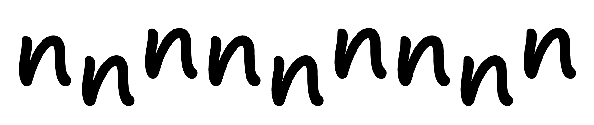
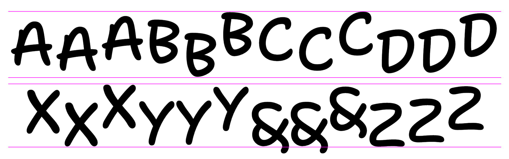
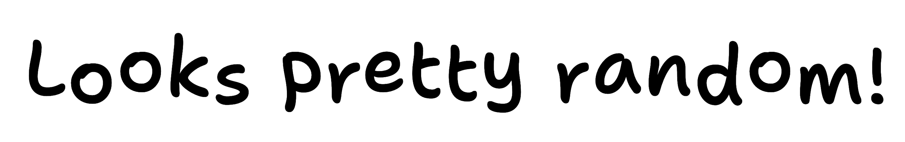

# Notes on randomization, Aug 17, 2020

I mentioned that I would try to explain how things are working a little more technically, then forgot to. 😅 Basically:

1. Each character has three versions: think of them as "A.1, A.2, A.3, B.1, B.2, B.3," and so on.

2. ".1" glyphs are randomly shifted up or down, ".2" glyphs are randomly shifted up, and ".3" glyphs are randomly shifted down – but only on the "Bouncy" side of the font’s overall designspace (its stylistic range, which right now has an axis for Weight and another for Bounce)

3. As you type, the computer tracks code in the font which selects which version of each character to show:
  1. The font starts by placing a character, like A.1
  2. If you type another character after a ".1" glyph, the font then places a ".2" glyph like B.2
  3. If you type a character after a ".2" glyph, the font then places a ".3" glyph like C.3

4. Because of point 2, if you go from Bouncy=0 (where no glyphs are shifted up or down) towards Bouncy=200 (where all glyphs are shifted either up or down), letters go from nice & orderly to nice & wild.

The code that creates the randomly-shifted letters is a little bit complex, but the logic that cycles through letter versions (as described in point 3) is actually surprisingly brief (the type designer & engineer Tal Leming [gets the credit for this approach](http://opentypecookbook.com/common-techniques/)):

```
feature rclt {
    @randomCycle1 = [A      B      C      D      E      F      G      H      I      J      K      L      M      N      O      P      Q      R      S      T      U      V      W      X      Y      Z      a      ampersand      asterisk      at      at.case      b      bracketleft      bracketright      c      colon      comma      copyright      d      dagger      daggerdbl      dollar      e      eight      ellipsis      emdash      endash      exclam      f      five      four      g      h      hyphen      i      j      k      l      m      minute      n      nine      numbersign      o      one      p      parenleft      parenright      period      q      question      quotedbl      quotedblleft      quotedblright      quoteleft      quoteright      quotesingle      r      s      second      section      semicolon      seven      six      slash      space      t      three      trademark      two      u      underscore      uni2010      v      w      x      y      z      zero];
    @randomCycle2 = [A.alt1 B.alt1 C.alt1 D.alt1 E.alt1 F.alt1 G.alt1 H.alt1 I.alt1 J.alt1 K.alt1 L.alt1 M.alt1 N.alt1 O.alt1 P.alt1 Q.alt1 R.alt1 S.alt1 T.alt1 U.alt1 V.alt1 W.alt1 X.alt1 Y.alt1 Z.alt1 a.alt1 ampersand.alt1 asterisk.alt1 at.alt1 at.case.alt1 b.alt1 bracketleft.alt1 bracketright.alt1 c.alt1 colon.alt1 comma.alt1 copyright.alt1 d.alt1 dagger.alt1 daggerdbl.alt1 dollar.alt1 e.alt1 eight.alt1 ellipsis.alt1 emdash.alt1 endash.alt1 exclam.alt1 f.alt1 five.alt1 four.alt1 g.alt1 h.alt1 hyphen.alt1 i.alt1 j.alt1 k.alt1 l.alt1 m.alt1 minute.alt1 n.alt1 nine.alt1 numbersign.alt1 o.alt1 one.alt1 p.alt1 parenleft.alt1 parenright.alt1 period.alt1 q.alt1 question.alt1 quotedbl.alt1 quotedblleft.alt1 quotedblright.alt1 quoteleft.alt1 quoteright.alt1 quotesingle.alt1 r.alt1 s.alt1 second.alt1 section.alt1 semicolon.alt1 seven.alt1 six.alt1 slash.alt1 space.alt1 t.alt1 three.alt1 trademark.alt1 two.alt1 u.alt1 underscore.alt1 uni2010.alt1 v.alt1 w.alt1 x.alt1 y.alt1 z.alt1 zero.alt1];
    @randomCycle3 = [A.alt2 B.alt2 C.alt2 D.alt2 E.alt2 F.alt2 G.alt2 H.alt2 I.alt2 J.alt2 K.alt2 L.alt2 M.alt2 N.alt2 O.alt2 P.alt2 Q.alt2 R.alt2 S.alt2 T.alt2 U.alt2 V.alt2 W.alt2 X.alt2 Y.alt2 Z.alt2 a.alt2 ampersand.alt2 asterisk.alt2 at.alt2 at.case.alt2 b.alt2 bracketleft.alt2 bracketright.alt2 c.alt2 colon.alt2 comma.alt2 copyright.alt2 d.alt2 dagger.alt2 daggerdbl.alt2 dollar.alt2 e.alt2 eight.alt2 ellipsis.alt2 emdash.alt2 endash.alt2 exclam.alt2 f.alt2 five.alt2 four.alt2 g.alt2 h.alt2 hyphen.alt2 i.alt2 j.alt2 k.alt2 l.alt2 m.alt2 minute.alt2 n.alt2 nine.alt2 numbersign.alt2 o.alt2 one.alt2 p.alt2 parenleft.alt2 parenright.alt2 period.alt2 q.alt2 question.alt2 quotedbl.alt2 quotedblleft.alt2 quotedblright.alt2 quoteleft.alt2 quoteright.alt2 quotesingle.alt2 r.alt2 s.alt2 second.alt2 section.alt2 semicolon.alt2 seven.alt2 six.alt2 slash.alt2 space.alt2 t.alt2 three.alt2 trademark.alt2 two.alt2 u.alt2 underscore.alt2 uni2010.alt2 v.alt2 w.alt2 x.alt2 y.alt2 z.alt2 zero.alt2];

    sub @randomCycle1 @randomCycle1' by @randomCycle2;
    sub @randomCycle2 @randomCycle1' by @randomCycle3;
} rclt;
```

When built into a font, this is what results in the pseudo-random behavior, which you can predict in a repeated single character if you know what to look for:




...but is made less predictable by further (bounded) randomization of overall up/down positioning in each character:



...and works together to look fairly unpredictable in most text:



An interesting sidenote: I also experimented with a more-complex, more truly-random approach, but it resulted in something that looked less random because double letters in words like "bookkeeper" ended up repeating at the same height about 33% of the time. To avoid that, it would require many more alternates in the fonts, but this becomes a game of diminishing returns, especially if we want to use this font on the web, where people like to keep font filesizes small. But, I will probably experiment a bit more on the specific approach to randomization, along with some experiments to overall letter proportions as mentioned on our call.
