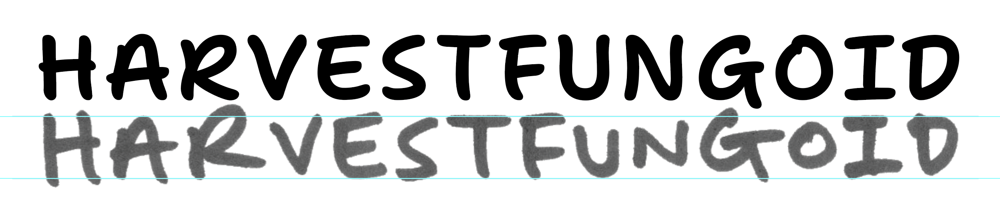

# Making organic proportions

## Questions 

Should the organic proportions be in the same axis as the bouncy baseline, or in a different one?

Should the organic proportions merely be sizing changes, or also changes in shaping?
- e.g. long `f`, longer descenders, things to make the writing more natural, more contrast, etc...

Should this have a backslant?

## Letter sizing

40 approx. tracking, uppercase

45 approx. tracking, lowercase

In percentages compared to normal (x%, y%):

S: 100, 95
V: 100, 84
U: 90, 80
N: 100, 65 // higher on right side / flatter on top
O: 82, 72
D: 90, 94 // pointer at top right
G: // Wide crossbar
I: 100, 90
C: 70, 76
J: 88, 90 // super wide top
K: diagonal is 80% y
L: 82, 71
M: 91, 79
P: 88, 93
Q: 112, 100
R: 100, 95 // long tail
W: 85, 75
X: 77, 72
Y: 104, 88 // wide left arm
Z:  83, 93 // long tail

h: 124, 111
r: // stem about 78% y
v: // right side about 107% y
e: 109, 115
s: 107, 129
t: 120, 92 // ascender to full height; normal stem, super-wide crossbar
f: 180, 100 // normal stem, super-wide crossbar
u: 90, 95
g: 110, 100
n: 102, 102
o: 97, 92
i: // dot stays high, stem is about 60% y
d: 100, 90 // ascender to full height
b: 87, 82
c: 84, 89 // bottom extends further than top
j: 100, 85 // descender very wide, goes to full height
k: 96, 104
l: 110, 100
m: 100, 83
p: 100, 81 // top stays at x-height, bowl comes up
w: 112, 87 // left stays almost full x-height, midde down further, 
x: 95, 92 // left bottom descends
y: // bowl comes up to 80% y\
z: 107, 111 // height to bottom (probably)

two: 100, 110 // tail about 120% x
three: 110, 122
four: 120, 98
four: 143, 146 // maybe too extreme; probably don’t use this one?
five: 100, 111
six: 109, 134
eight: 80, 100
nine: 96, 91
zero: 104, 105

**Moved to `sources/organic_experiment_04-alts-shift-shaping/transforms.yaml`**

...for use in `scripts--robofont/make_transformed_layer--sel_fonts.py`