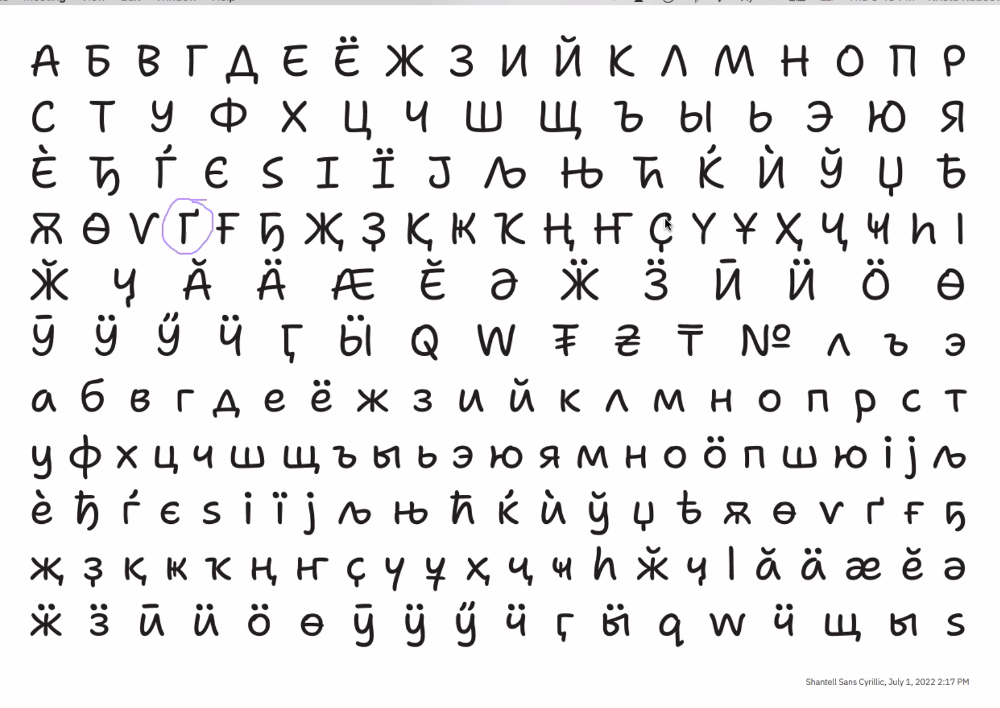
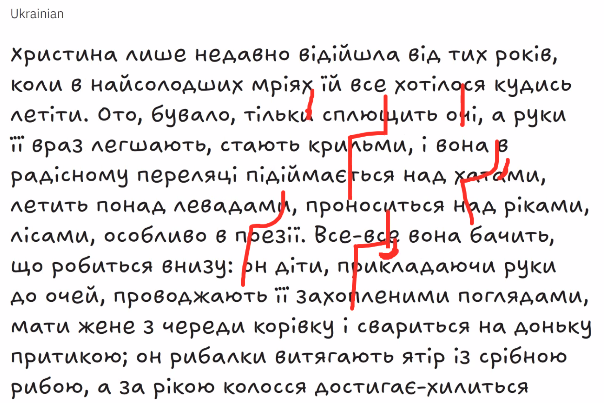
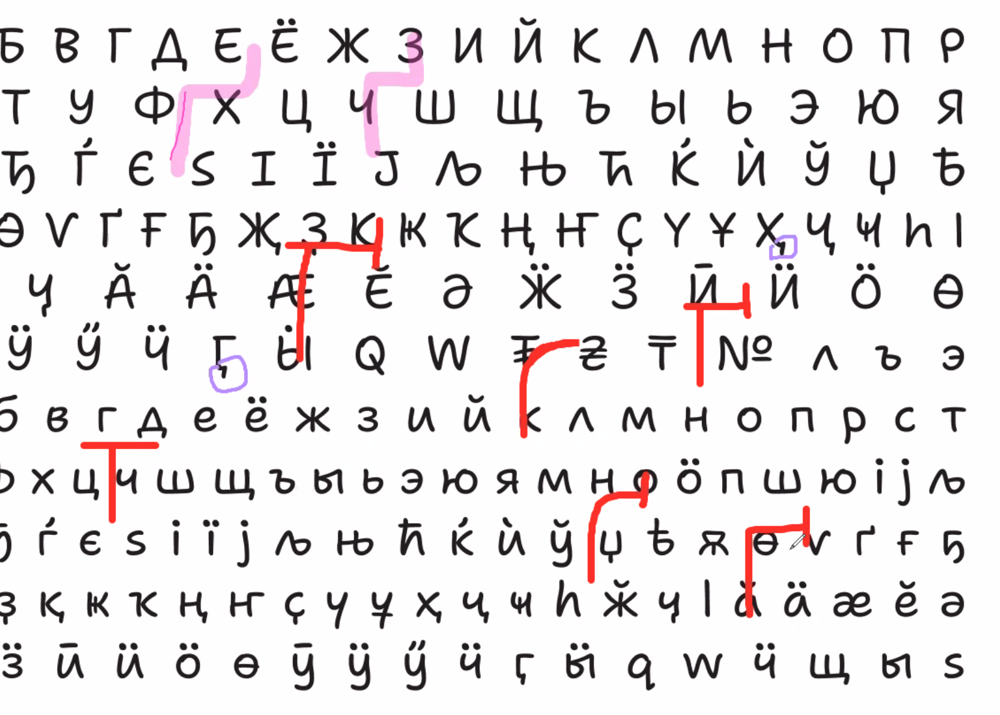
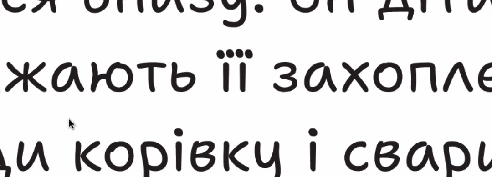
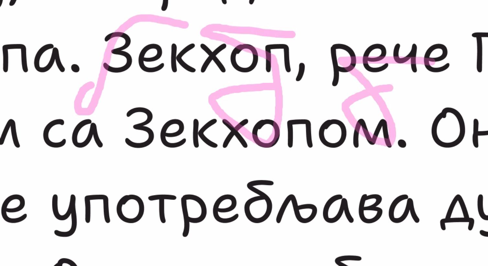
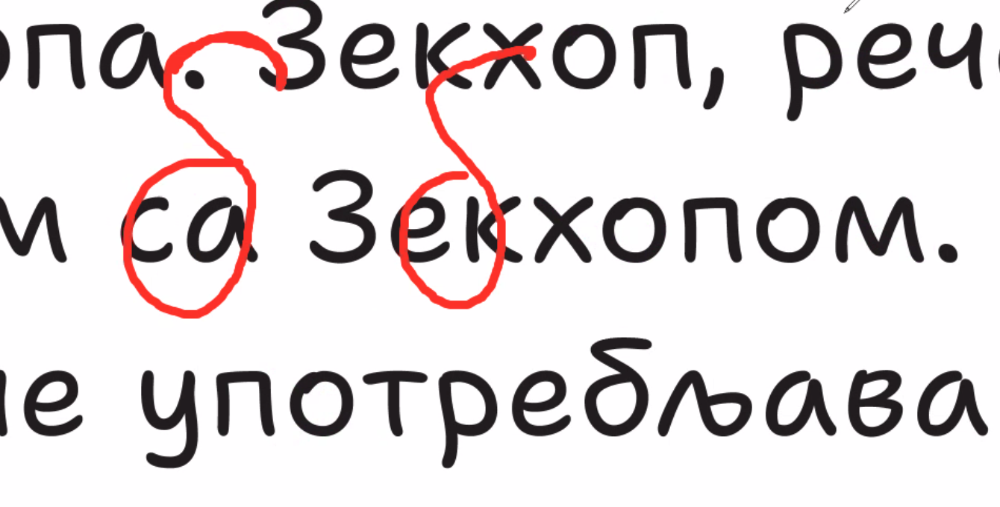
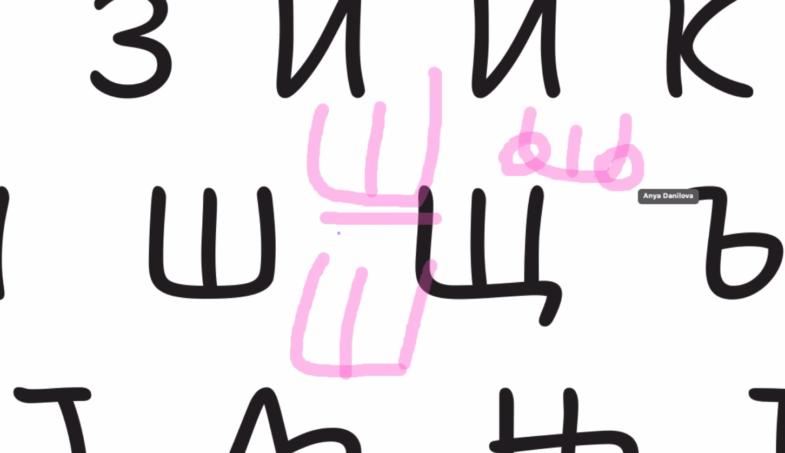

# Review w/ Krista and Maria, July 7, 2022

Krista: Bulgarian is looking better

Maria: This is maybe a little too tiny, and could be shaped a little differently in Ukrainian
- Krista: Spike could be bigger?
- Anya: yeah, especially in Irregular style
  - And maybe it would be good to try a softer/more rounded shape

- Maria: I think maybe in uppercase it actually makes more sense to make stem the first movement, then others separately
  - But in lowercase, in cursive, you would have rounding on the top left
  - Ukrainians have told me that the spike is nice with a bottom part
  - Anya: but the bottom part looks serify to me...
  - Maria: it's a bit like when you're writing and you have a bit of overshoot in a cross bar
  - Krista: maybe we're over-thinking it, but in any case, the spike should be longer on top

Maria: Otherwise, everything is looking nice and good
- I was looking at the dots on the Ukranian diereses, but they look pretty good
- It would be good to make the spacing similar in `ïï` vs `iï`

Anya: Alexei commented on Serbian beh (?)
- I corrected the Light version
- He pointed out that the extrabold version looks like delta
- But it felt like it matched the vibe of Shantell's writing, with corners
- I didn't want it too be too soft

Maria: to me, the main difference between the beh and the delta, the top right goes down
- but in a beh, you could make it more up-going

Stephen: would a delta ever be used near a beh?
- Maria: no, but it's just that it looks like a foreign letter
  - so, it could be made slightly more natural
  - but of course, this isn't a "schoolbook" style handwriting font, anyway
  - Anya: yeah, that drawing would fit better though

Anya: Alexei said that it would be hard to write like this, and suggested a separate right stroke
  - but in my own writing, I make it together and it gets a bit rounded on both sides
  - Stephen: Shantell does write letters with fewer strokes than usual, like the Latin P or K
  - Krista: it doesn't bother me
  - Maria: people have different handwritten forms

Anya: great, now all we have is italics...
- Stephen: but really, those are just a simple slanted version. It's like someone is writing the same way, just a little faster

Anya: next proofs?
- Maria: middle and masters

## Tasks

Stephen
- [ ] Check that `ïï` is getting alts in the irregular styles (or is this a ligature?)

Anya:
- [ ] Check on kerning in `ïï` vs `iï`
- [ ] adjust Serbian beh (?)
- [ ] Look at the f turn (?)